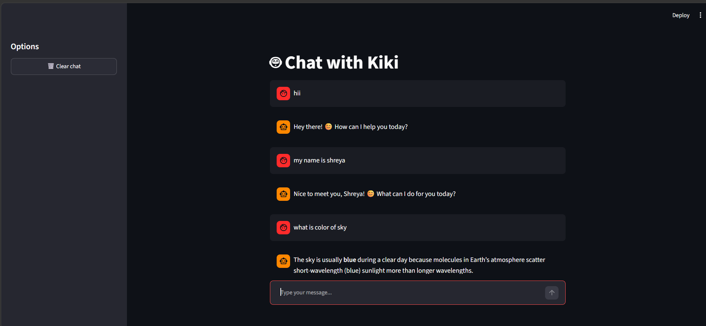
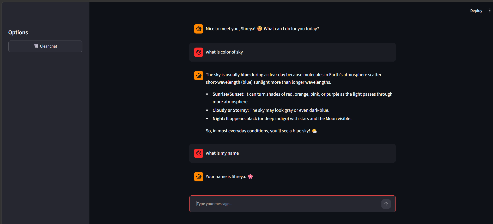

# Kiki AI Chatbot

Kiki is a small, conversational AI chatbot built with LangChain and Groq. This repository provides two ways to chat with the same assistant: a browser-based Streamlit interface with streamed responses, and a simple interactive terminal program.

## Purpose

This project is a practical first chatbot application. It demonstrates how to connect a LangChain chat model to a user interface, keep a conversation's messages as context, and configure model access with an environment variable. The assistant is given the name Kiki and a helpful-assistant persona.

## Features

- Streamlit chat UI with responses streamed as they are generated.
- Conversation history retained during the current Streamlit session.
- A sidebar action to clear the web chat.
- Terminal-based interactive chat using the same Groq model.
- Model: `openai/gpt-oss-120b` via `langchain-groq`.

## Screenshots

The following screenshots show sample sessions from the web interface:





## Requirements

- Python 3.13 or newer.
- A Groq API key with access to the configured model.
- [uv](https://docs.astral.sh/uv/) to install the project dependencies and run the app.

Dependencies are declared in `pyproject.toml` and pinned by `uv.lock`.

## Configuration

Set `GROQ_API_KEY` in a local `.env` file in the repository root:

```dotenv
GROQ_API_KEY=your_groq_api_key
```

The applications load this file with `python-dotenv`. Keep the key private and do not commit it to source control.

## Run the Streamlit app

From the repository root:

```powershell
uv sync
uv run streamlit run app.py
```

Streamlit prints a local URL in the terminal; open it in a browser to chat with Kiki. Messages are streamed into the page as they are generated. Use **Clear chat** in the sidebar to start a fresh conversation.

## Run the terminal chatbot

In a terminal from the repository root:

```powershell
uv sync
uv run python ChatBot.py
```

Enter a message at the `user :` prompt. Type `exit` to end the session.

## Sample conversations

Model responses vary by run. These are illustrative examples of the interaction, not fixed application output.

### Web chat

```text
You: Hi Kiki, what can you help me with?
Kiki: I can answer questions, explain concepts, brainstorm ideas, and help with everyday tasks. What would you like to work on?
```

### Terminal chat

```text
user : What is LangChain?
AI : LangChain is a framework for building applications powered by language models. It provides building blocks for connecting models with prompts, tools, and other data sources.
user : exit
```

## Project structure

```text
.
├── app.py                         # Streamlit web chat
├── ChatBot.py                     # Interactive terminal chatbot
├── assets/
│   ├── sample_output_1.png         # Web chat screenshot
│   └── sample_output_2.png         # Web chat screenshot
├── pyproject.toml                 # Project metadata and dependencies
├── uv.lock                        # Locked dependency versions
└── src/
	└── my_first_chatbot/
		└── __init__.py            # Package scaffold
```

## Notes

- Both chatbot interfaces currently send conversation messages to the Groq-hosted model; avoid entering sensitive information.
- The Streamlit conversation is held in session state and is not stored as a persistent chat log.
- The `my-first-chatbot` project script currently runs a package scaffold that prints a greeting. Use the commands above to run the chatbot interfaces.
